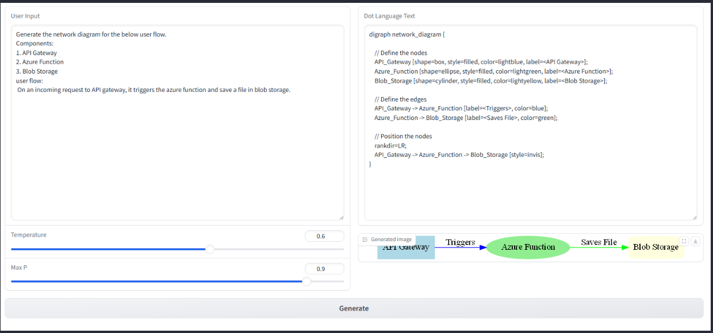

# diagramgenie

Hackathon 2024 project
# Setting up the environment
- Install Python (Recommended: https://www.anaconda.com/download/success)
- Create a virtual environment and activate the environment
- Open the Conda prompt and run the below command to install the dependencies
  - `pip install -r requirements.txt`
# Deploying and configuring the model
- Create a model deployment in Azure AI Studio and get the model endpoint and the API Key
  - Ref: https://learn.microsoft.com/en-us/azure/ai-studio/how-to/deploy-models-openai
- Create a .env file in the root directory with the below content
  
  ```
  API_KEY=XXXXXXXXXXXXXXXXX
  ENDPOINT=https://XXXXXXXXXXXXXXXXXXXXXX.XXX.XXX.com/v1/chat/completions
# Running the application
- Run the below command from `src` folder to launch the application
  - `gradio main.py`
# UI Screenshots

